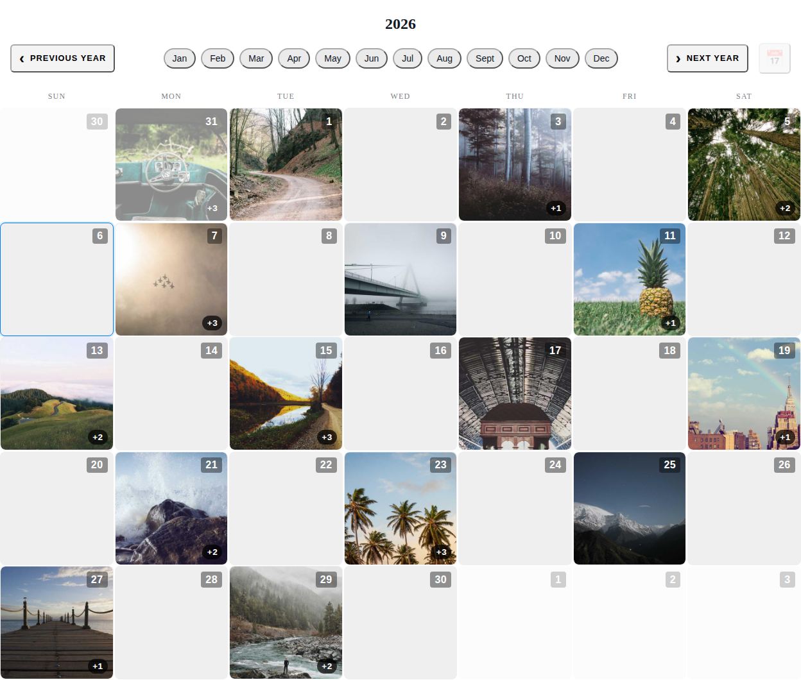
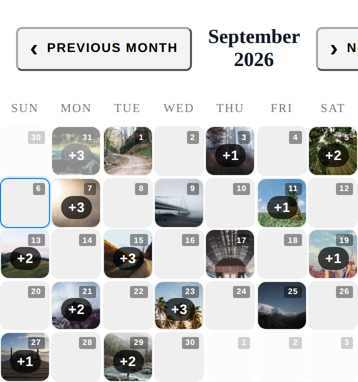
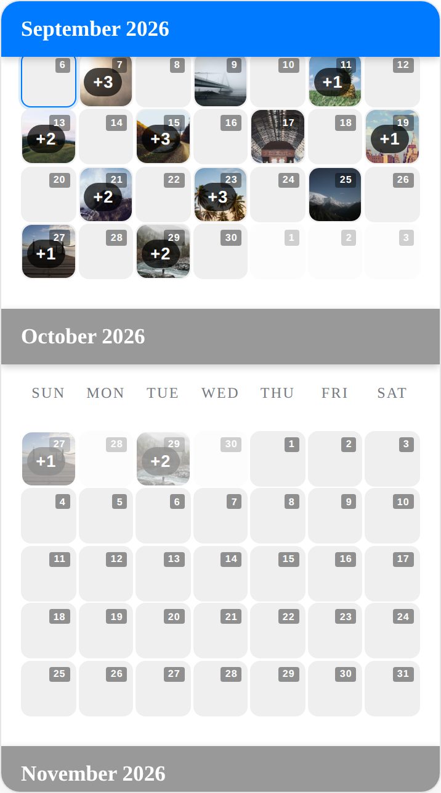
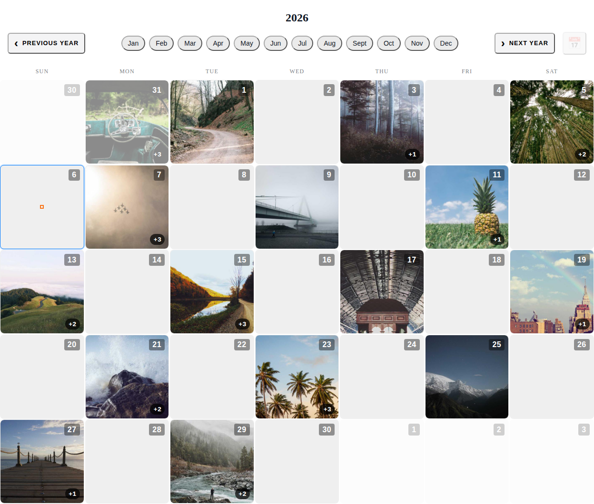
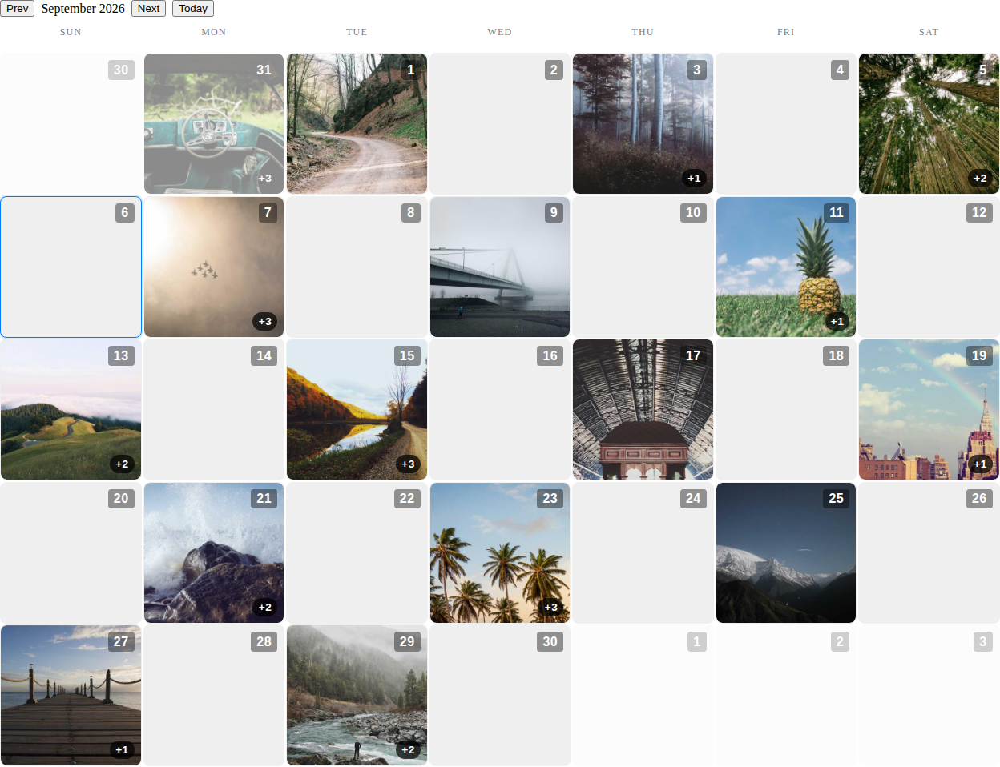

# react-photo-calendar

[](https://www.npmjs.com/package/react-photo-calendar)
[](https://github.com/ljmerza/react-photo-calendar/actions/workflows/ci.yml)
[](LICENSE)

A React month-view calendar that renders photo thumbnails on each day. Headless
primitives with a styled reference UI on top, so you can use it as-is or rebuild
the entire surface without forking.

No runtime dependencies. React 18.2+ or 19 as a peer.

<details>
<summary><strong>Screenshots</strong></summary>

<br>

**Desktop** — the default component, with month chips, year navigation, and per-day overflow badges.



**Mobile** — the same component at 390px.



**Scroll mode** — `navigationMode="scroll"` renders a continuous timeline with sticky month headers instead of paged navigation.



**Custom day cells** — `renderDay` replaces the cell entirely while keeping calendar state.



**Headless composition** — primitives assembled by hand with your own controls.



</details>

## Installation

```bash
npm install react-photo-calendar
```

```tsx
import { PhotoCalendar } from 'react-photo-calendar';
import 'react-photo-calendar/styles.css'; // optional reference styling

const entries = [
  { datetime: '2026-09-07T10:00:00Z', photos: ['/a.jpg', '/b.jpg'] },
  { datetime: '2026-09-11T18:30:00Z', photos: ['/c.jpg'] },
];

export function App() {
  return (
    <PhotoCalendar
      entries={entries}
      defaultMonthKey="2026-09"
      onDaySelect={({ isoDate }) => console.log(isoDate)}
    />
  );
}
```

The stylesheet is optional. The primitives ship unstyled; `styles.css` only
carries the reference UI used by the `PhotoCalendar` convenience component.

## Data

One entry per moment, grouped onto days by the calendar:

```ts
interface PhotoEntry {
  datetime: string;  // ISO datetime
  photos: string[];  // first URL becomes the day's preview
}
```

Days show up to `maxThumbnailsPerDay` thumbnails and a `+N` badge for the rest.

## Props

`PhotoCalendar` also accepts every `div` attribute.

| Prop | Type | Default | Description |
|---|---|---|---|
| `entries` | `PhotoEntry[]` | `[]` | Photos to place on days |
| `monthKey` | `string` | — | Controlled month, `YYYY-MM` |
| `defaultMonthKey` | `string` | current month | Uncontrolled starting month |
| `onMonthChange` | `(monthKey: string) => void` | — | Fired when the month changes |
| `onDaySelect` | `({ isoDate, date }) => void` | — | Fired when a day is activated |
| `onRangeChange` | `(range: VisibleRange) => void` | — | Visible bounds; use it to fetch |
| `onVisibleMonthChange` | `(monthKey: string) => void` | — | Month scrolled into view |
| `firstDayOfWeek` | `0`–`6` | `0` | 0 = Sunday |
| `maxThumbnailsPerDay` | `number` | — | Thumbnails before the `+N` badge |
| `minMonthKey` / `maxMonthKey` | `string` | — | Clamp navigation |
| `locale` | `string` | system | Weekday and month label locale |
| `timeZone` | `string` | system | Day-boundary time zone |
| `navigationMode` | `'controls' \| 'scroll'` | `'controls'` | Paged or continuous timeline |
| `scrollMaxRenderedMonths` | `number` | — | Months kept mounted in scroll mode |
| `renderDay` | `(props: DayRenderProps) => ReactNode` | — | Replace the day cell |
| `renderDayContent` | `(ctx: DayRenderContext) => ReactNode` | — | Replace cell contents only |
| `renderNavigation` | `(props: NavigationRenderProps) => ReactNode` | — | Replace navigation |
| `renderWeekdays` | `(props: WeekdayRenderProps) => ReactNode` | — | Replace weekday headers |

Controlled and uncontrolled both work: pass `monthKey` with `onMonthChange` to
drive it yourself, or `defaultMonthKey` to let it manage its own state.

## Fetching by visible range

`onRangeChange` reports the first and last dates on screen, including the
leading and trailing days from adjacent months:

```tsx
<PhotoCalendar
  entries={entries}
  onRangeChange={({ startIso, endIso }) => fetchPhotos(startIso, endIso)}
/>
```

## Headless primitives

Compose your own UI against the same state. `PhotoCalendarRoot` provides
context; every other primitive consumes it.

```tsx
import {
  PhotoCalendarRoot,
  PhotoCalendarNavigation,
  PhotoCalendarWeekdays,
  PhotoCalendarMonthGrid,
} from 'react-photo-calendar';

<PhotoCalendarRoot entries={entries} defaultMonthKey="2026-09">
  {(state) => (
    <section role="grid" aria-label={`Photo calendar for ${state.monthLabel}`}>
      <PhotoCalendarNavigation>
        {(nav) => (
          <header>
            <button onClick={() => nav.navigateMonth(-1)} disabled={!nav.canNavigatePrevMonth}>
              Back
            </button>
            <span>{nav.monthLabel}</span>
            <button onClick={() => nav.navigateMonth(1)} disabled={!nav.canNavigateNextMonth}>
              Forward
            </button>
            <button onClick={nav.goToToday}>Today</button>
          </header>
        )}
      </PhotoCalendarNavigation>

      <PhotoCalendarWeekdays />
      <PhotoCalendarMonthGrid />
    </section>
  )}
</PhotoCalendarRoot>
```

`PhotoCalendarMonthGrid` takes a `renderDay` prop to override cell contents, and
a `dayStates` prop for multi-month layouts. Navigation can also be assembled from
smaller pieces (`PhotoCalendarNavigationMonthChips`, `…TodayButton`, and friends)
instead of a render prop.

`usePhotoCalendarState` exposes the same state directly if you want no markup at
all, and `usePhotoCalendarContext` reads it from inside a `PhotoCalendarRoot`.

See [docs/photo-calendar-render-props.md](docs/photo-calendar-render-props.md)
for the full render-prop contracts.

## Styling

`styles.css` is plain CSS driven by custom properties, so most theming is a
matter of overriding tokens rather than rewriting rules:

```css
:root {
  --calendar-color-accent: #2563eb;
}
```

See [docs/photo-calendar-design-tokens.md](docs/photo-calendar-design-tokens.md)
for the token list. Skip the stylesheet entirely and the primitives render
unstyled.

## Development

```bash
npm install
npm run storybook   # http://localhost:6006
```

| Script | Purpose |
|---|---|
| `npm test` | Vitest suite |
| `npm run test:coverage` | Tests with coverage |
| `npm run lint` | ESLint |
| `npm run typecheck` | `tsc --noEmit` |
| `npm run build` | ESM + CJS bundles and declarations |

Storybook is the playground; stories live in `src/stories/`. See
[docs/storybook-guide.md](docs/storybook-guide.md).

## Releasing

CI runs lint, typecheck, tests and a build on every PR. To release: bump
`version` in `package.json`, merge, then tag.

```bash
git tag v1.2.3 && git push origin v1.2.3
```

The tag publishes to npm via [trusted publishing](https://docs.npmjs.com/trusted-publishers/)
(OIDC, no stored token) and creates a GitHub release. The build fails if the tag
and `package.json` version disagree.

## License

MIT
